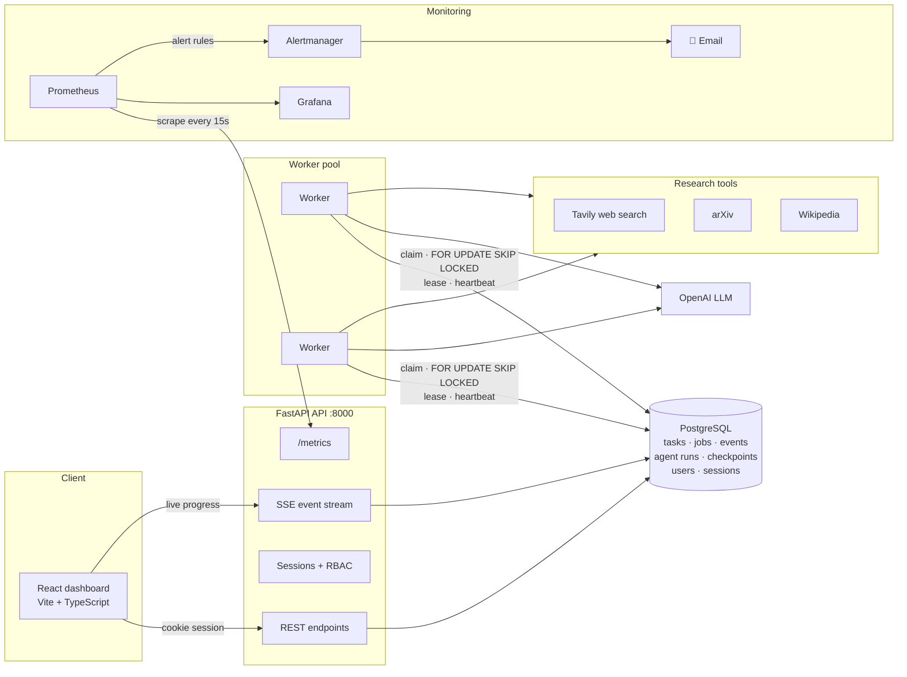
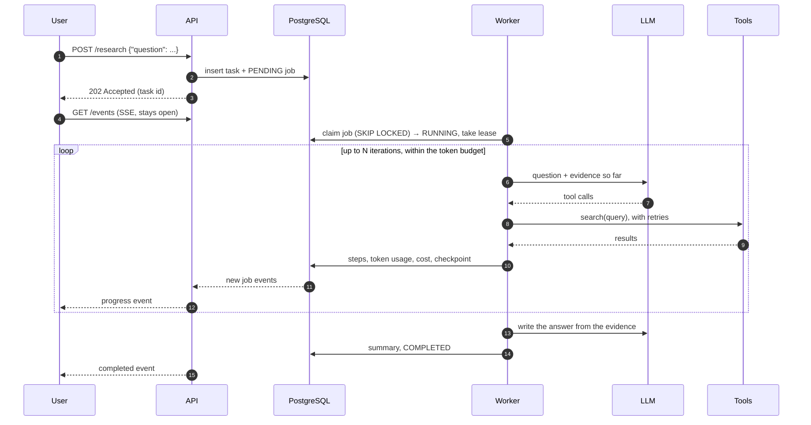
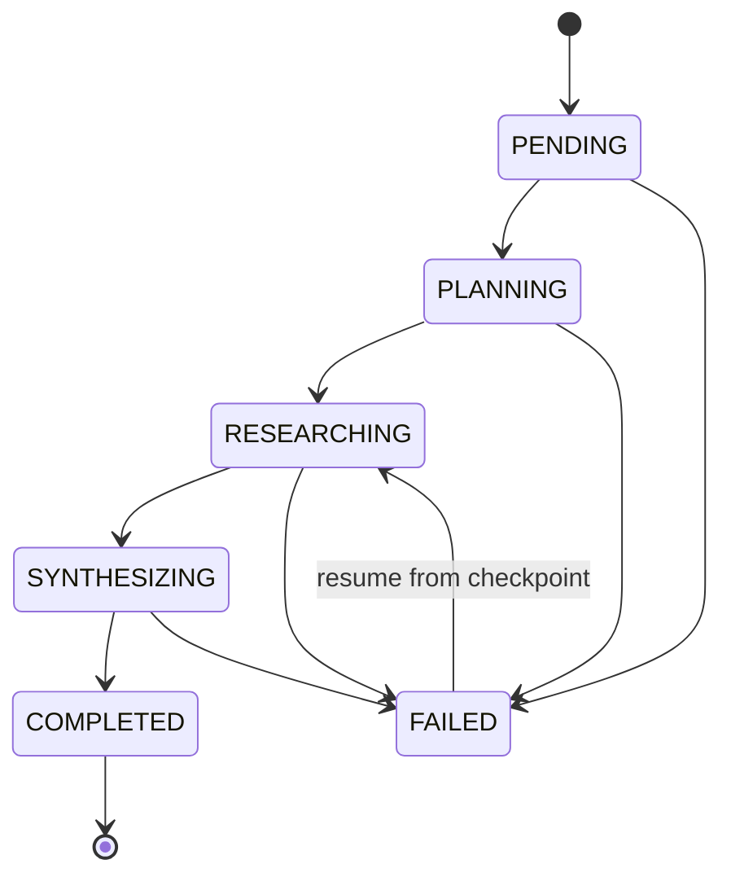

<div align="center">

# 🔎 Research Agent

**A production-style AI research service: ask a question, an LLM agent researches it across the web, arXiv and Wikipedia, and returns a cited summary, with the job queue, observability, SLOs and access control a real service needs.**

[**Project website →**](https://senayberhe.github.io/research-agent/)


</div>

---

## Why this project exists

Calling an LLM in a loop is the easy part of an "AI agent". Running one **as a service** is harder: requests outlive HTTP calls, workers crash mid-run, tokens cost money, external APIs fail, and somebody has to know when things are going wrong.

This project is my answer to *"what does it take to run an LLM agent in production?"* It's a complete system, not a notebook:

- 🧠 **An agent** that plans searches, calls tools, and writes a summary grounded in what it found
- 📬 **A durable job queue** in PostgreSQL, with leases, heartbeats, retries and crash recovery
- 💾 **Checkpoint and resume**: a run that fails at step 5 resumes from step 5 without paying for steps 1–4 again
- 💸 **Cost control**: token budgets per run, and cost tracked per call against real model prices
- 📈 **Observability**: Prometheus metrics, Grafana dashboards, alert rules with unit tests, SLOs with error budgets
- 🔐 **Security**: server-side sessions, role-based access control, CSRF protection, sign-in throttling
- 🖥️ **A React dashboard** with live progress over server-sent events

| | |
|---|---|
| **Backend** | ~12,000 lines of Python (FastAPI, SQLAlchemy 2 async, Alembic) |
| **Tests** | **595 tests**, ~15,500 lines, against a real PostgreSQL |
| **Frontend** | ~5,300 lines of React 19 + TypeScript |
| **Ops** | 6 Docker services, 12 Prometheus alert rules (unit tested), 5 SLOs |

---

## Architecture



### Life of a research request



### Task state machine

Every status change goes through one validated transition table (`app/services/state_machine.py`), so a task can't skip from `PENDING` to `COMPLETED`, and a bug that tries fails loudly.



---

## Engineering highlights

Each of these is a problem I ran into, and how I solved it.

### 1. A job queue that survives crashes, without Redis or Celery

Jobs live in PostgreSQL. Workers claim them with `SELECT … FOR UPDATE SKIP LOCKED`, so any number of workers can poll the same table and **two workers never get the same job**, without a separate broker.

A claimed job carries a **lease**. The worker renews it on a heartbeat. If a worker dies (OOM, a deploy, a pulled cable), its lease expires and the next worker puts the job back on the queue. If a worker finds out its lease was **taken over**, it cancels its own run rather than keep spending tokens on work someone else now owns.

On `SIGTERM` a worker stops claiming, gives the current job a grace period, and then hands it straight back to the queue. Deploys don't lose work.

> `app/jobs/worker.py` · `app/jobs/service.py` · `app/services/recovery_service.py`

### 2. Checkpoint and resume for LLM runs

LLM runs are slow and cost money, so restarting from scratch after a failure is wasteful. After **every iteration** the agent writes a versioned checkpoint: the conversation so far, the tool results, and the token totals. A failed task can be resumed (`POST /research/{id}/resume`) and carries on from its last checkpoint. Its token and cost totals carry over, so budgets stay honest across attempts.

Checkpoints have a schema version. A checkpoint written by an older layout is rejected clearly instead of being half-read.

> `app/agents/research_agent.py` (`AgentCheckpoint`) · `app/tests/test_agent_checkpoint.py` · `test_resume_workflow.py`

### 3. Cost is a first-class metric

Every LLM call records input, cached-input and output tokens, priced against a per-model table (`app/llm/pricing.py`). Each run has a **token budget** and stops before it overspends. Cost appears per run, per task, and system-wide on the dashboard, and there's a Prometheus alert (`HighLLMCostRate`) for when spend runs away.

### 4. SLOs and error budgets, not just dashboards

Five SLOs are defined in code (`app/core/slo.py`) and evaluated over a rolling 30-day window:

| SLO | Target |
|---|---|
| Research job success | 99% of finished jobs complete |
| Tool success | 98% of tool calls succeed |
| Job latency | p95 under 60 s |
| Tool latency | p95 under 15 s, per tool |
| API availability | 99.9% (measured by Prometheus) |

Each SLO reports its remaining **error budget** and **burn rate**. Alerts fire on a fast burn as well as on exhaustion. An SLO with no data in the window reports `no_data`, never "healthy": silence isn't success.

### 5. Alert rules are tested like code

The 12 Prometheus alert rules (`monitoring/alerts/`) have **unit tests** run with `promtool test rules`, so a typo in a PromQL expression or a wrong threshold is caught before it reaches production. The fast-burn alert uses the SRE-workbook threshold: burning 14.4× faster than allowed, which spends 2% of a 30-day budget in an hour.

### 6. Security done properly

- **Server-side sessions** in an `httpOnly`, `SameSite=Lax` cookie. Page scripts can't read it, and only its **SHA-256** is stored, so a leaked database copy can't be used to sign in.
- **Revocation**: signing out, a password change or deactivation ends sessions immediately. A stateless JWT can't do that before it expires.
- **CSRF**: requests that change something are refused if they come from a page on a foreign origin.
- **Sign-in throttling** per username and per IP address, returning `429` with `Retry-After`.
- **Argon2id** password hashing. A login with an unknown username takes as long as one with a wrong password, so timing doesn't reveal which usernames exist.
- **RBAC** with four roles (`viewer` → `researcher` → `operator` → `admin`). A test walks **every route × every role** and fails if a new endpoint forgets its permission check.
- The system refuses to remove or demote **the last active admin**.

### 7. Live progress without holding database connections

`GET /events` streams server-sent events with `Last-Event-ID` resume, so a dropped connection picks up where it left off. The first version held a pooled database connection for the whole stream, which meant one connection per open browser tab, kept for minutes. Now each poll uses its own short session, and a regression test asserts that only one session is open while streaming.

### 8. Testing strategy

- **595 tests** against a real PostgreSQL. No SQLite stand-in, so `SKIP LOCKED`, JSON columns and constraints behave as they do in production.
- A **fake LLM and fake tools** script exact agent behaviours (tool calls, failures, token usage), so agent tests are deterministic and cost nothing.
- Covered: concurrent job claims, lease expiry and takeover, crash recovery, graceful shutdown, checkpoint round-trips, state-machine rules, SLO and error-budget maths, auth and RBAC on every route.

---

## Tech stack

| Layer | Technologies |
|---|---|
| **API** | Python 3.13, FastAPI, Pydantic v2, async SQLAlchemy 2, asyncpg |
| **Agent** | OpenAI (tool calling), Tavily, arXiv, Wikipedia |
| **Data** | PostgreSQL 18, Alembic migrations |
| **Frontend** | React 19, TypeScript, Vite, React Router, react-markdown |
| **Observability** | Prometheus, Grafana, Alertmanager |
| **Security** | Argon2id (pwdlib), cookie sessions, RBAC, CSRF origin check |
| **Tooling** | uv, pytest + pytest-asyncio, oxlint, Docker Compose |

---

## Running it

Requirements: Docker, plus [uv](https://docs.astral.sh/uv/) and Node.js for local development.

```bash
cp .env.docker.example .env.docker               # API keys (OpenAI, Tavily), database URL, worker settings
cp .env.alertmanager.example .env.alertmanager   # alert email settings
printf '%s' 'your-smtp-password' > monitoring/alertmanager/secrets/smtp_password

docker compose up -d --build
```

| Service | URL |
|---|---|
| API (interactive docs) | http://localhost:8000/docs |
| Dashboard (`cd frontend && npm install && npm run dev`) | http://localhost:5173 |
| Prometheus | http://localhost:9090 |
| Grafana (admin / `GRAFANA_ADMIN_PASSWORD`, default `admin`) | http://localhost:3000 |
| Alertmanager | http://localhost:9093 |
| PostgreSQL (from the host) | `localhost:5433` |

The API applies database migrations on startup. Create the first account:

```bash
docker compose exec api uv run --no-sync python -m app.cli create-user alice --role admin
```

### Development

```bash
uv sync
docker compose up -d postgres     # the tests use the research_test database
uv run pytest                     # 595 tests
cd frontend && npm run build && npm run lint
```

After changing a model: `uv run alembic revision --autogenerate -m "..."`, then `uv run alembic upgrade head`.

---

## Project structure

```
app/
├── agents/        # ResearchAgent (tool-calling loop, checkpoints, token budget), planner, synthesizer
├── tools/         # Tavily, arXiv, Wikipedia behind one ResearchTool interface + registry
├── llm/           # LLM provider abstraction, per-model pricing
├── jobs/          # Worker: claim, lease, heartbeat, graceful shutdown; job events
├── services/      # Business logic: state machine, recovery, SLOs, error budgets, metrics, sessions…
├── api/           # FastAPI routers: research, jobs, events (SSE), health, metrics, auth, users
├── core/          # Settings, permissions (RBAC), security, SLO definitions, Prometheus registry
├── db/            # SQLAlchemy models
└── tests/         # 595 tests, fake LLM and tools
alembic/           # Database migrations
frontend/          # React + TypeScript dashboard
monitoring/        # Prometheus config, alert rules + tests, Grafana dashboards, Alertmanager
docs/              # The project website (GitHub Pages)
```

---

## Reference

<details>
<summary><b>API endpoints</b></summary>

All responses are JSON except `/metrics` (Prometheus text). Timestamps are UTC.

**Research**

| Method | Path | |
|---|---|---|
| POST | `/research` | Create a task (`{"question": "..."}`); queued for a worker, returns 202 |
| GET | `/research?limit=20&offset=0&status=` | Tasks, newest first, paginated: `{items, total, limit, offset}` |
| GET | `/research/{task_id}` | One task: question, status, summary |
| POST | `/research/{task_id}/resume` | Retry a failed task from its last checkpoint |
| GET | `/research/{task_id}/timeline` | Everything that happened, in order (job events, steps, agent runs) |
| GET | `/research/{task_id}/execution` | The task and its jobs |
| GET | `/research/{task_id}/metrics` | Jobs, retries, tool calls, latency, tokens, cost for the task |
| GET | `/research/{task_id}/jobs` | The task's jobs |
| GET | `/research/{task_id}/jobs/{job_id}/events` | One job's events |
| GET | `/research/{task_id}/runs` | Agent runs: tokens, cost, duration |
| GET | `/research/{task_id}/steps` | Tool calls with their results |

**Jobs and workers**

| Method | Path | |
|---|---|---|
| GET | `/jobs/{job_id}` | A job with its attempts and events |
| GET | `/jobs/{job_id}/execution` | Current state, history, and the agent run's tokens, tools and cost |
| GET | `/jobs/{job_id}/timeline` | The job's events as plain text |
| GET | `/workers?hours=24` | Each worker's state: busy, idle or unresponsive |
| GET | `/events` | Server-sent events: live job progress (`Last-Event-ID` resume) |

**System health, metrics and SLOs**

| Method | Path | |
|---|---|---|
| GET | `/health` | Database, workers and job queue: healthy, degraded or unhealthy |
| GET | `/health/jobs` | Job queue health |
| GET | `/research/metrics` | System-wide totals, all time |
| GET | `/research/metrics/system?hours=24` | Detailed metrics for a time window, per tool |
| GET | `/research/metrics/timeseries?range=24h` | Jobs finished and p95 latency per period (24h, 7d, 30d) |
| GET | `/research/slo` | Each SLO over the rolling window: healthy, breached or no_data, with its error budget |
| GET | `/research/slo/error-budget` | Each SLO's error budget in detail: events, burn rate, status |
| GET | `/metrics` | Prometheus metrics |

**Accounts**

| Method | Path | |
|---|---|---|
| POST | `/auth/login` | Sign in; sets the session cookie |
| POST | `/auth/logout` | End this session |
| GET | `/auth/me` | The signed-in user, role and permissions |
| GET / POST | `/users` | List / create users (admins) |
| PATCH | `/users/{user_id}` | Change role, active state or password (admins) |

</details>

<details>
<summary><b>Accounts and sign-in</b></summary>

Everything except `GET /`, `GET /health`, `GET /metrics` (Prometheus), `POST /auth/login` and `POST /auth/logout` needs a signed-in user. `POST /auth/login` (`{"username": ..., "password": ...}`) sets an httpOnly session cookie (SameSite=Lax) that the browser sends with every request; `POST /auth/logout` ends it. Sessions are stored in `user_sessions` (only a hash of the cookie's value) and last `AUTH_SESSION_HOURS` (default 8). Set `AUTH_COOKIE_SECURE=true` wherever the app is served over HTTPS.

Requests that change something are refused (403) if they come from a page on an origin other than the API's own or one in `CORS_ORIGINS`. Repeated failed sign-ins get 429 for a while (`AUTH_LOGIN_MAX_FAILURES`, per username; `AUTH_LOGIN_MAX_FAILURES_PER_IP`; within `AUTH_LOGIN_WINDOW_SECONDS`). A new password or deactivation signs the user out everywhere.

| Role | Can |
|---|---|
| `viewer` | See research, jobs and results |
| `researcher` | + start and resume research |
| `operator` | + analytics: system metrics, SLOs, error budgets, workers |
| `admin` | + manage users |

There's no sign-up: an admin creates accounts.

```bash
docker compose exec api uv run --no-sync python -m app.cli create-user alice   # prompts for a password (12+ chars)
docker compose exec api uv run --no-sync python -m app.cli set-role alice researcher
docker compose exec api uv run --no-sync python -m app.cli list-users
docker compose exec api uv run --no-sync python -m app.cli set-password alice
docker compose exec api uv run --no-sync python -m app.cli deactivate alice    # can't sign in; open sessions end
```

Or set `AUTH_ADMIN_USERNAME` / `AUTH_ADMIN_PASSWORD` to create the first admin on startup (only when there are no users yet).

</details>

<details>
<summary><b>Monitoring</b></summary>

- **Prometheus** scrapes `api:8000/metrics` every 15 s. Everything is computed from the database, so totals survive restarts and cover every worker. Config: `monitoring/prometheus.yml`.
- **Alert rules**: `monitoring/alerts/research-agent-alerts.yml`, covering job failure rate and latency, tool failure rate and latency, stalled workers, runaway agent runs, LLM cost and token rate, API down, missing scrape targets, and error-budget fast burn and exhaustion. Unit tests are in `monitoring/alerts/tests/` (run with `promtool test rules`; see the comment at the top of the test file).
- **Grafana** loads the Prometheus data source and the "Research Agent Production Dashboard" from `monitoring/grafana`.
- **Alertmanager** emails firing alerts. Settings come from `.env.alertmanager` and `monitoring/alertmanager/secrets/smtp_password`, both ignored by git. For Gmail, use an App Password.

</details>

<details>
<summary><b>Configuration</b></summary>

Settings are environment variables (see `.env.example`). Highlights:

| Variable | Default | |
|---|---|---|
| `LLM_MODEL` | `gpt-5.6-terra` | OpenAI model the agent uses |
| `AGENT_MAX_TOTAL_TOKENS` | 20000 | Token budget per agent run |
| `WORKER_LEASE_SECONDS` | 300 | How long a worker's claim on a job lasts without renewal |
| `WORKER_MAX_ATTEMPTS` | 3 | Attempts before a job fails for good |
| `SLO_WINDOW_DAYS` | 30 | Rolling window for SLOs and error budgets |
| `AUTH_SESSION_HOURS` | 8 | How long a sign-in lasts |
| `AUTH_COOKIE_SECURE` | false | HTTPS-only cookie (turn on in production) |
| `CORS_ORIGINS` | `["http://localhost:5173"]` | Browser origins allowed to call the API (JSON list) |

</details>

---

<div align="center">

Built by [**@senayberhe**](https://github.com/senayberhe)

</div>
